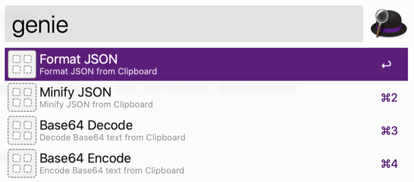

## alfred-genie

Genie for Alfred

[](https://github.com/namuan/alfred-genie/blob/master/LICENSE) [](https://twitter.com/deskriders_twt)



### Using from Alfred

Install `Alfred Genie.alfredworkflow` in Alfred and use the `genie` command to use any available function.


### Using from Command line

```
$ pip install alfred-genie
```

Then the following commands will be available

```
$ alfred-genie 
Usage: alfred-genie [OPTIONS] COMMAND [ARGS]...

Options:
  --help  Show this message and exit.

Commands:
  base64-decode
  base64-encode
  commands # ignore this as this is only used from Alfred
  format-json
  minify-json
```

### Contributing

Pull requests are welcome. 
For major changes, please open an issue first to discuss what you would like to change.

You'll need a working version of `Python3` to run these scripts.

1) Create and use new virtual env

```
python3 -m venv venv
source venv/bin/activate
```

2) Install required dependencies

```
$ pip install -r requirements.txt
```

3) Run locally

```
$ python local_main.py ...
```

### Creating Alfred Workflow

For publishing it in workflow, we need to perform following additional steps

- [ ] Open workflow file in Alfred
- [ ] Open workflow directory in Terminal
- [ ] Apply any changes from this directory to workflow directory
- [ ] Use [SourceGear diffmerge](https://sourcegear.com/diffmerge/) to compare and apply any changes
```
$ diffmerge ~/workspace/alfred-genie/ `pwd`/
```
- [ ] Install any dependencies in workflow directory `pip install --target=. click`
- [ ] Export workflow and publish to Github

### Publishing Updates to PyPi

```shell
$ make package
```

Enter the username and password for pypi.org repo when prompted


### License

[MIT](https://choosealicense.com/licenses/mit/)
